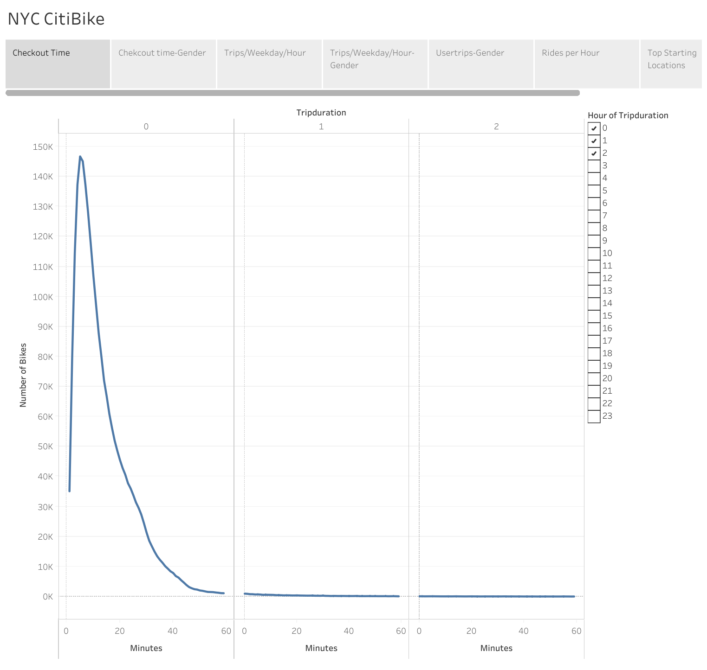
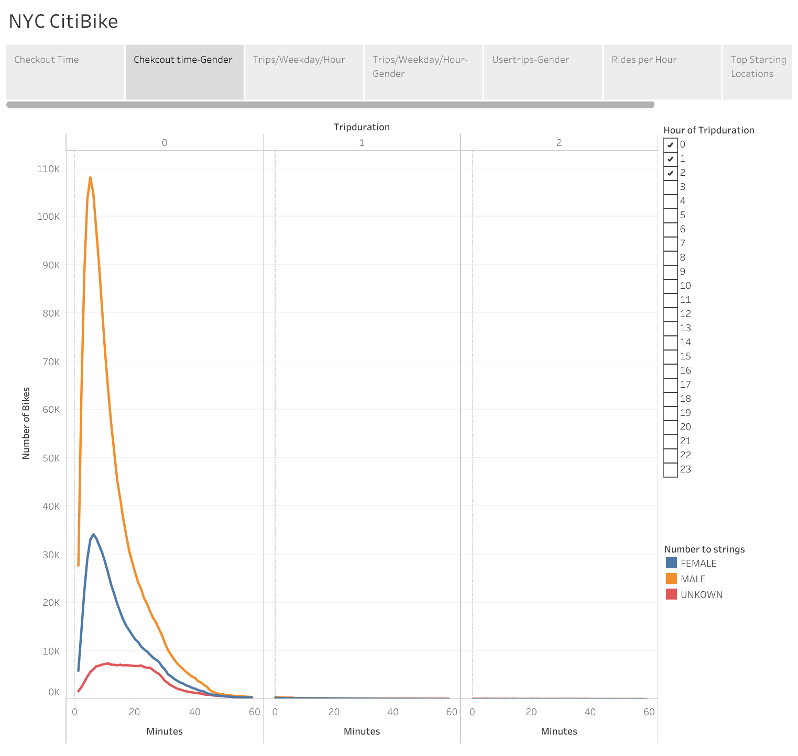
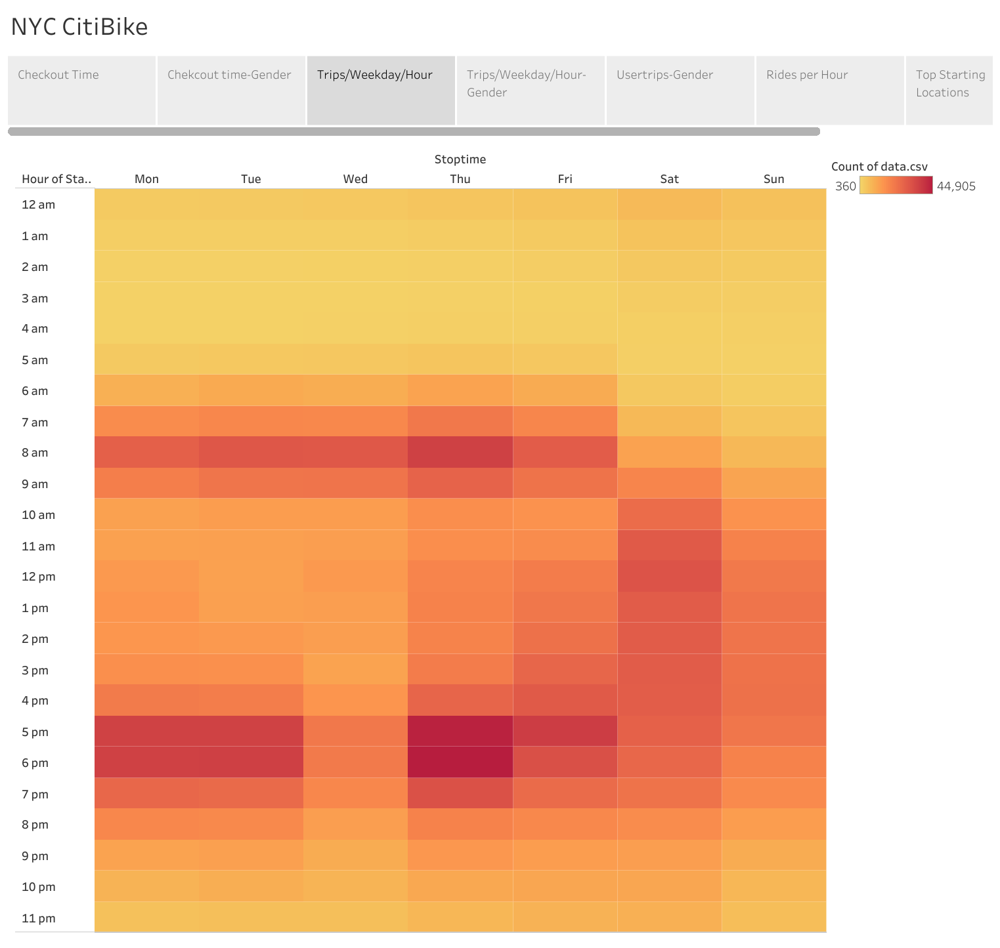
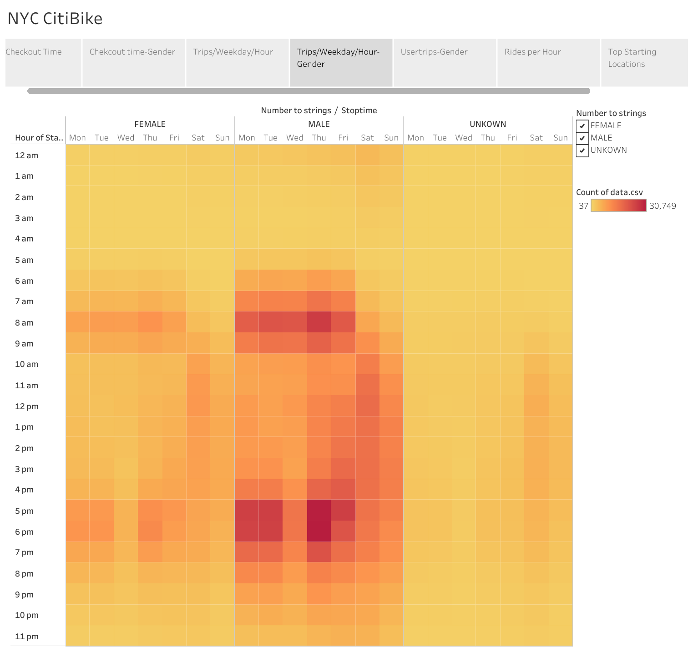
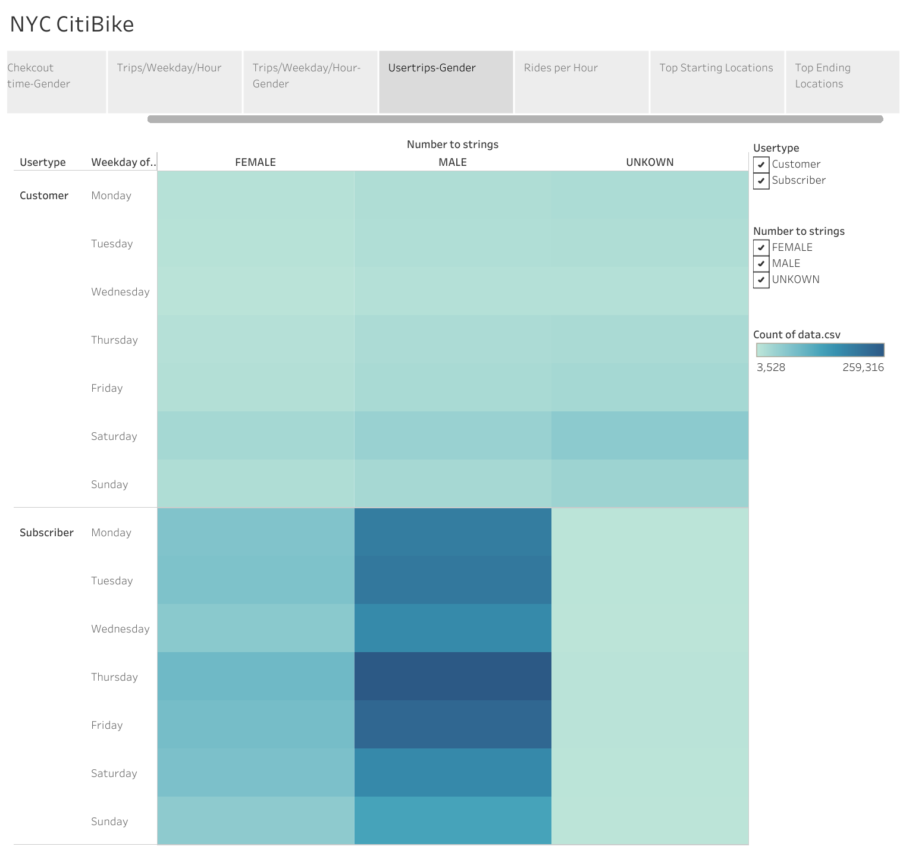
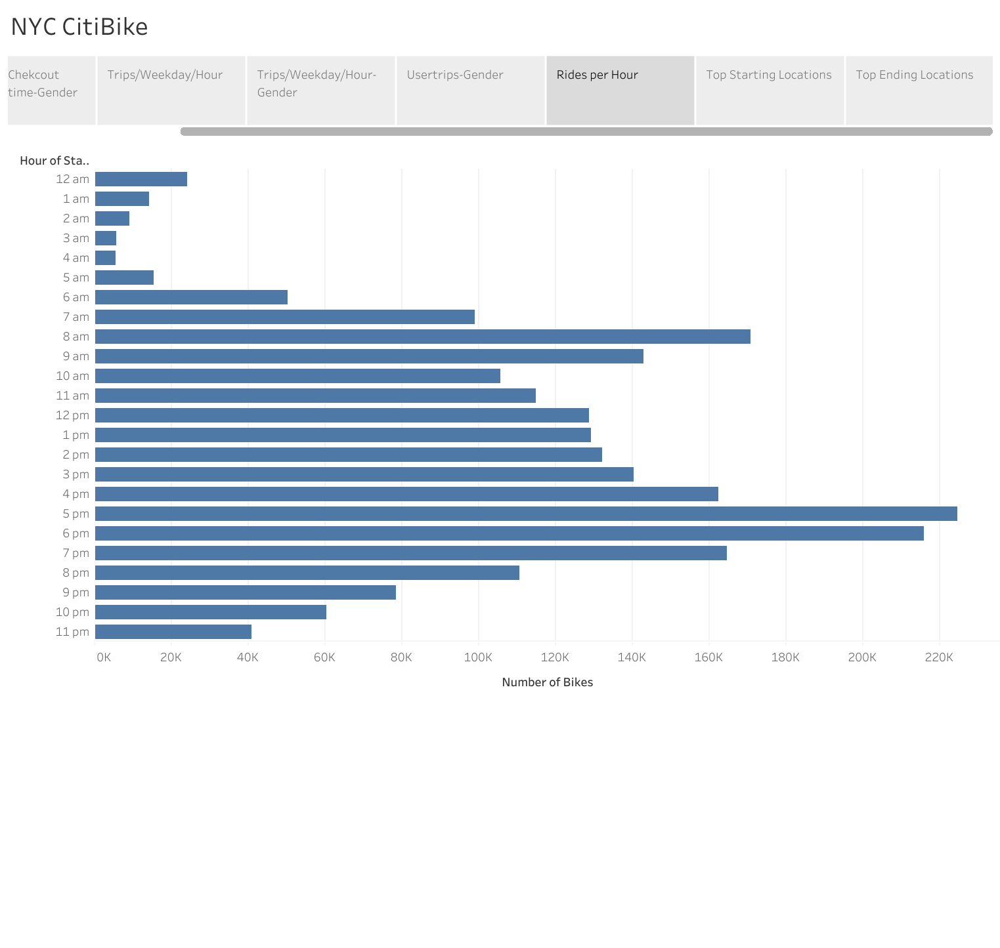
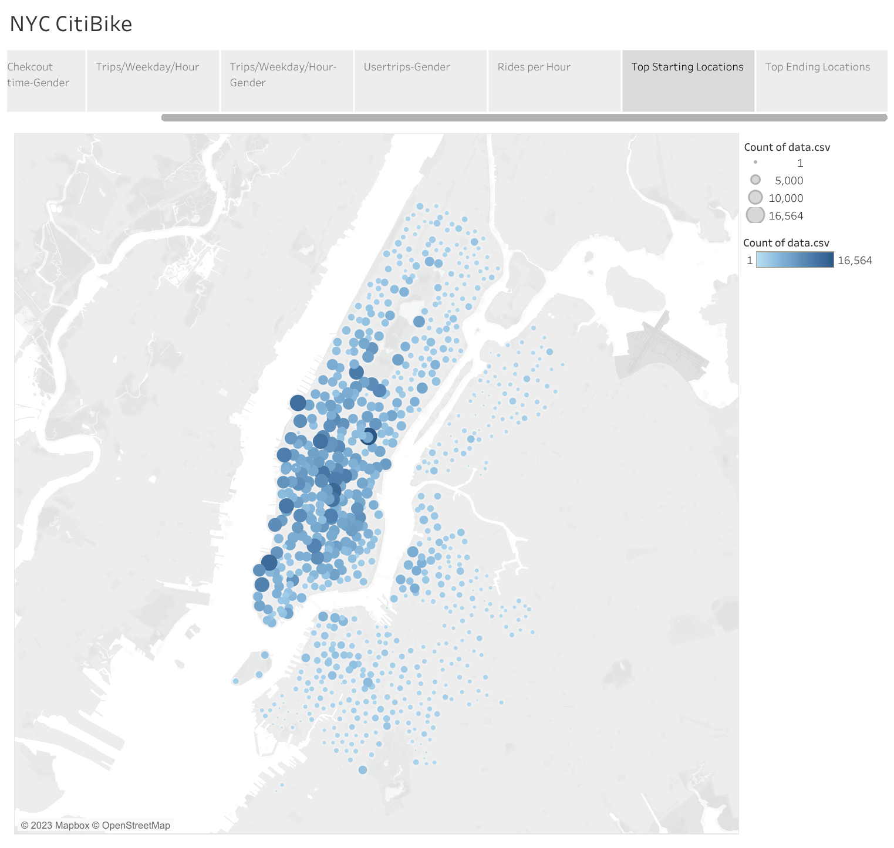
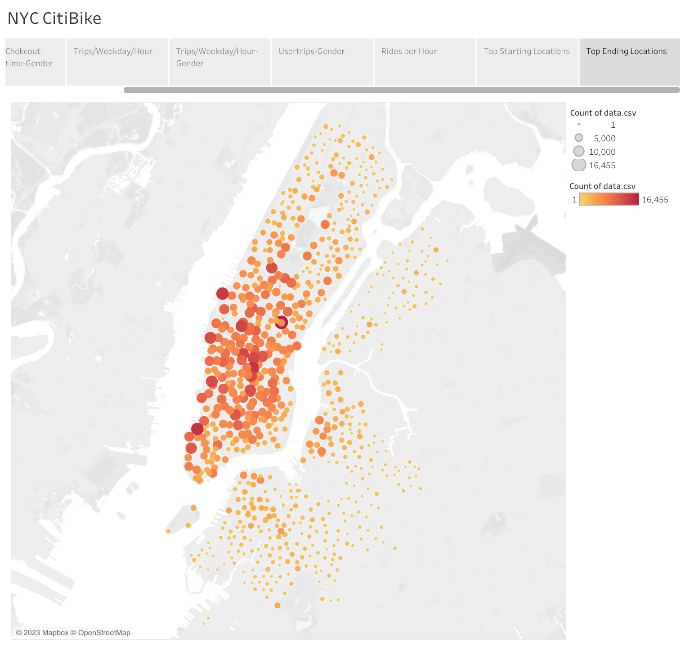

# bikesharing
## Project Overview
We are presenting a business proposal for bike-sharing program in Des Moines. To solidify the proposal, one of the key stakeholders would like to see a bike trip analysis. We want to visualize the data using Tableau in order to tell a story that will inspire practical conclusions regarding profitability with potential investors lined up.
## Results
[Link to the Tableau dashboard](https://public.tableau.com/app/profile/deepam.das/viz/Module15_16748633397450/Story1#2)

Checkout Time for Users:

The typical length of a rider's trip is depicted in this image. The majority of riders take between 10 and 20 minutes, after which there is a steep drop-off. This can help decide pricing based on trip duration, and also choose type of bike being used.

Checkout Times for Users by Gender:

While average trip duration is nearly same for males and females, whole service looks almost 4 times as likely to be used by males than females.

Trips by Weekday per Hour:

This heatmap showa two high demand points. one around 8 am and another from 5-7 pm. This pattern can be obsereved on all days except for weekends and wednesday.

Trips by Weekday per Hour by Gender:

The overall usage patterns are fairly consistent (each gender has the same peak times in the overall statistics). The checkout times demonstrate that males use more than any other gender.

Usertrips by Gender per Weekday

A significant number of our customers are male subscribers, and a significant number of our riders tend to be subscribers as well.

Rides per Hour:

We will be able to accommodate with the necessary inventory if we know when there is a high or low demand. The morning and evening commute times are typically the busiest and the slowest times are from 2 to 5 in the morning. To ensure that we have enough supplies for the morning commute, the ideal time to carry out any maintenance would be in the early morning hours.

Top Starting Locations:

Top trip start locations.

Top Ending Locations:

Top trip ending locations.

## Summary
We have shown that this service is in high demand in Manhattan. Most people use it during rush hours on weekdays. Most of the users fall in categories of male and subscribed customers.

Analysing starting and ending trip locations may help understand where users usually need bike. It will help replicate business model in Des Moines.

Further suggested visualiation: 
   - starting location, ending location by subscripton type.
   - trips by users by subscripton type
 This information can help us understand usage pattern of tourists. 
